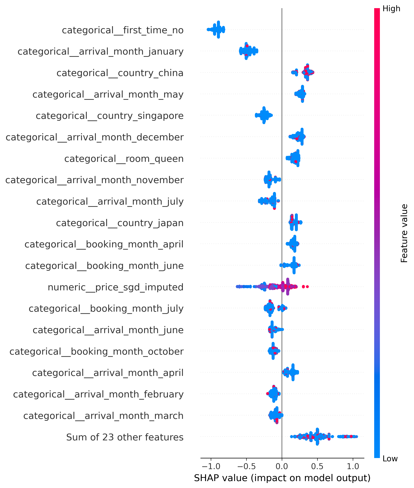

## Introduction
This project is a technical case study from AI Singapore’s AI Apprenticeship Programme (AIAP)®.

# Hotel No-Show Prediction

This project builds a classification model to predict whether a hotel booking will result in a no-show.

The workflow is organized into four main stages:
1. Data source
2. Preprocessing
3. Feature engineering
4. Model training and evaluation

## Data Source

The dataset is stored in a SQLite database:

```
HotelNoshowPrediction/data/noshow.db
```

## Preprocessing
Main preprocessing steps:

- Load the raw data from SQLite.
- Drop rows where all fields except `booking_id` are missing.
- Fix invalid negative `checkout_day` records.
- Convert negative but valid `checkout_day` values to absolute values.
- Create `days_difference` from arrival and checkout dates.
- Standardize price values into SGD.
- Convert `num_adults` and `num_children` into numeric values.
- Clean categorical columns by stripping whitespace and converting  to lowercase.
- Treat missing `room` values as their own category.
- Drop columns that are not useful for modeling.
- Impute missing `price_sgd` values using room-level median price.

## Feature Engineering
Main feature engineering steps:

- Separate features `X` from target `y`.
- Drop `booking_id` because it is only an identifier.
- Use `no_show` as the target variable.
- Split the data into training and testing sets.
- Identify categorical, ordinal, and numeric columns.
- Build a feature preprocessor using `ColumnTransformer`.

Feature treatment:

| Feature Type | Columns | Treatment |
|---|---|---|
| Categorical | `branch`, `booking_month`, `arrival_month`, `country`, `first_time`, `room` | One-hot encoding |
| Ordinal | `num_children` | Passthrough |
| Numeric | `price_sgd_imputed` | Passthrough |

`num_children` is treated as ordinal because the values have a natural order:

```
0 children < 1 child < 2 children
```

Tree-based models do not require `StandardScaler`, so numeric and ordinal features are passed through directly.

One-hot encoder settings are also configurable:

```yaml
encoder:
  handle_unknown: ignore
```

`handle_unknown: ignore` prevents errors when the model sees a new category during prediction.

## Model Selection


The selected models are:

```
Extra Trees
Random Forest
XGBoost
```

These models were selected because the dataset is tabular and contains a mix of categorical, ordinal, and numerical features. Hotel no-show behaviour is also likely to be non-linear. For example, the effect of `price_sgd_imputed` may differ by `room`, `country`, `booking_month`, or `first_time`.

Tree-based ensemble models are suitable for this type of problem because they can capture these feature interactions without requiring strict linear assumptions. They also work well after one-hot encoding categorical variables and do not require feature scaling.

The three models provide a useful comparison:

- **Extra Trees** acts as a fast and highly randomized tree ensemble.
- **Random Forest** acts as a more stable bagging-based tree ensemble.
- **XGBoost** acts as a stronger boosting-based model that learns from previous errors.


```
models:
  extra_trees:
    n_estimators: 300
    class_weight: balanced
    random_state: 42
    n_jobs: -1

  random_forest:
    n_estimators: 300
    class_weight: balanced
    random_state: 42
    n_jobs: -1

  xgboost:
    n_estimators: 300
    learning_rate: 0.05
    max_depth: 5
    subsample: 0.8
    colsample_bytree: 0.8
    eval_metric: logloss
    random_state: 42
```

## Model Evaluation

```
metrics:
  primary: roc_auc
  scoring:
    - accuracy
    - precision
    - recall
    - f1
    - roc_auc
```

### Accuracy

Accuracy measures how many total predictions are correct.

```
correct predictions / all predictions
```

It is easy to understand, but it can be misleading if the dataset is imbalanced.

### Precision

Precision measures how often the model is correct when it predicts no-show.

```
true no-shows predicted / all predicted no-shows
```

It is useful when false alarms are costly (false positives)

### Recall

Recall measures how many actual no-shows the model successfully catches.

```
true no-shows predicted / all actual no-shows
```

It is useful when missing no-shows is costly (false negatives).

### F1 Score

F1 score balances precision and recall.

It is useful when both false positives and false negatives matter.

### ROC AUC

ROC AUC measures how well the model separates show and no-show bookings across different thresholds.

```
0.5 = random guessing
0.7 = decent
0.8 = good
0.9+ = very strong
```
This project uses `roc_auc` as the primary metric.

## Current Result

```
        model  accuracy  precision  recall     f1  roc_auc
      xgboost    0.7296     0.6850  0.4994 0.5777   0.7734
random_forest    0.6832     0.5786  0.5315 0.5541   0.7206
  extra_trees    0.6652     0.5479  0.5489 0.5484   0.6894
```

Based on the primary metric `roc_auc`, the best model is:

```
XGBoost
```

with:

```
roc_auc score = 0.7734
```

## Feature Importance

Feature importance is generated in:

```
src/feature_importance.py
```

The project reports the **top 10 features** for the best-performing model.

The feature-importance values come from the trained tree-based model:

```python
model.feature_importances_
```

After one-hot encoding, the model sees expanded feature names such as:

```
categorical__branch_changi
categorical__booking_month_december
categorical__country_singapore
ordinal__num_children
numeric__price_sgd_imputed
```

The importance figure represents how useful each feature was when the model made tree splits. If a feature is frequently used to create good splits that improve classification, it receives a higher importance score.

For XGBoost, the importance reflects how much the feature contributed to improving the boosted trees.
The values are sorted in descending order, so the most influential features appear first.
Current top 10 feature importance for the best model, XGBoost:

```
                             feature  importance
          categorical__country_china      0.2487
          categorical__first_time_no      0.0865
         categorical__first_time_yes      0.0694
          categorical__branch_changi      0.0564
         categorical__branch_orchard      0.0519
          categorical__country_japan      0.0469
      categorical__country_indonesia      0.0430
          categorical__country_india      0.0343
      categorical__country_australia      0.0288
      categorical__country_singapore      0.0206
```

Important note:

```
Feature importance shows predictive usefulness, not causation.
```

## SHAP Feature Importance

SHAP feature importance is also generated in:

```
src/feature_importance.py
```

Unlike `model.feature_importances_`, SHAP explains each prediction by estimating how much each transformed feature pushes the model output higher or lower. The project ranks features by their mean absolute SHAP value:

```python
shap_importance_df = importance_analyzer.get_top_shap_features(
    fitted_pipelines[best_model_name],
    X_test,
    top_n=10,
    sample_size=1000,
)
```

The SHAP beeswarm visual is generated with:

```python
importance_analyzer.plot_shap_beeswarm(
    fitted_pipelines[best_model_name],
    X_test,
    sample_size=1000,
    max_display=20,
    show=False,
)
plt.tight_layout()
plt.savefig("shap_beeswarm.png", dpi=300, bbox_inches="tight")
```

The beeswarm plot shows:

- Features ranked from most influential to least influential.
- Each dot as one booking in the sampled test data.
- Dot position as the SHAP impact on the prediction.
- Dot color as the feature value, where red is higher and blue is lower.

Current top 10 SHAP feature importance for the best model, XGBoost:

```
                            feature  mean_abs_shap
         categorical__first_time_no         0.9031
 categorical__arrival_month_january         0.4755
         categorical__country_china         0.3315
     categorical__arrival_month_may         0.2631
     categorical__country_singapore         0.2456
categorical__arrival_month_december         0.2383
            categorical__room_queen         0.1817
categorical__arrival_month_november         0.1724
    categorical__arrival_month_july         0.1668
         categorical__country_japan         0.1637
```

Based on SHAP, the features with the largest impact on model predictions are:

- `first_time_no`: the strongest SHAP feature. Whether a guest is not a first-time customer has the largest average effect on the model output.
- `arrival_month`: several arrival-month indicators appear near the top, especially January, May, December, November, and July. This suggests seasonality is important for predicting no-shows.
- `country`: China, Singapore, and Japan are among the most influential country indicators, meaning guest origin contributes meaningfully to the prediction.
- `room_queen`: room type also affects the model, though less strongly than first-time status and the leading arrival-month/country features.
- `price_sgd_imputed`: price appears in the beeswarm plot, showing that booking price still affects predictions, but it is not in the top 10 by mean absolute SHAP value.




## How To Run

From the project root:

```bash
cd HotelNoshowPrediction/src
python main.py
```

Or from the repository root:

```bash
python HotelNoshowPrediction/src/main.py
```
